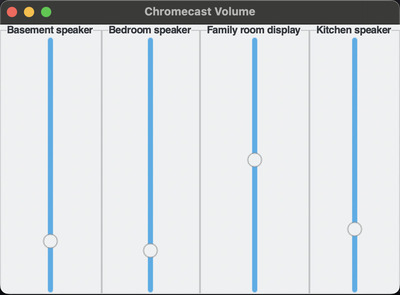

# Chromecast Volume Control GUI

A simple Chromecast Volume Control GUI.

Now you can change your volume from your laptop!



Implemented with Python and tkinter. Works on MacOS. Let me know if it works for you on Windows.

After the initial scan to locate Chromecast Devices on your network, startup time becomes pretty quick due to caching.

## Installation

```bash
pip install git+https://github.com/iandennismiller/cc-volume.git
```
